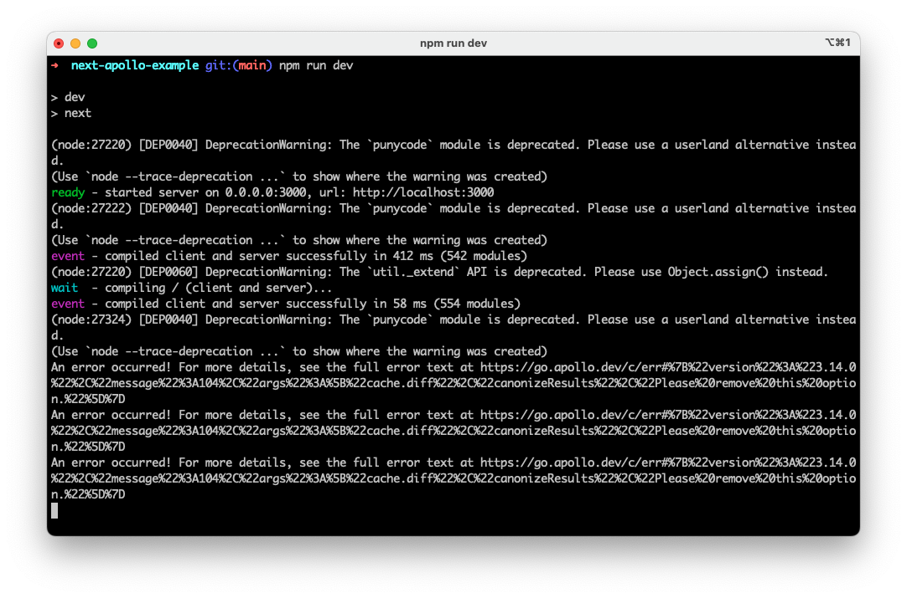

Minimum reproducible example for:

- https://github.com/apollographql/apollo-client/issues/13057
- https://github.com/apollographql/apollo-client/issues/12917#issuecomment-3273282404

How to reproduce:

- `npm install`
- `npm run dev`
- Open `localhost:3000`

You'll see in your terminal:

> An error occurred! For more details, see the full error text at https://go.apollo.dev/c/err#%7B%22version%22%3A%223.14.0%22%2C%22message%22%3A104%2C%22args%22%3A%5B%22cache.diff%22%2C%22canonizeResults%22%2C%22Please%20remove%20this%20option.%22%5D%7D

